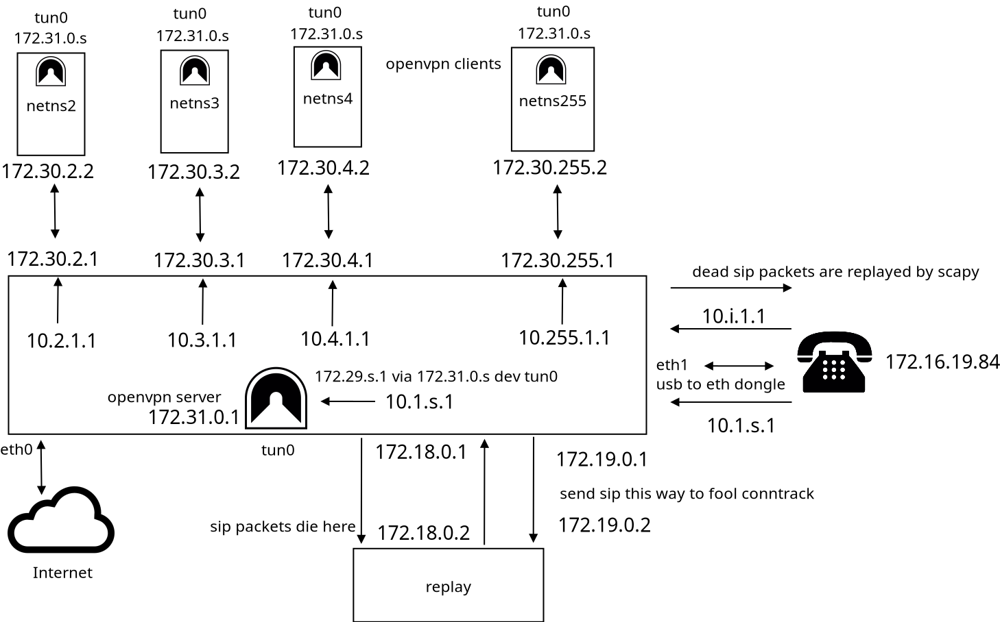

# voider

Direct Ip Calls, wich are ip agnostic.
the private phone number on the phone itself is always : **172.16.19.85/30**
the gateway is always : **172.16.19.86/30**.

Being able to forward ports on your router makes you a senator.

No need for static ip addresses, .onion addresses are used as the 
anchors.

Use the phone GXP1610. Other interoperable phones are still being searched. 

Conference calls are now possible with the GXP1610!

-->Only 3 participants on the gxp1610 .

(The conferencee makes a call to the 2nd participant. Then the 3rd participant, calls the person doing the conference (the line does not seem busy). The conferencee puts the current line on hold, picks up the other line, presses the conference button, and then selects the first line.)

 

**How to install** :

wget https://cdimage.ubuntu.com/releases/22.04.3/release/ubuntu-22.04.4-preinstalled-server-arm64+raspi.img.xz

xz -d ubuntu-22.04.4-preinstalled-server-arm64+raspi.img.xz

write the image of ubuntu server to a micro sd card :

sudo dd if=ubuntu-22.04.4-preinstalled-server-arm64+raspi.img of=/dev/sdX

use a raspi 4 (usb to eth dongle has network conflicts at booting with raspi 3)

ssh into the raspi 4; ssh ubuntu@ip; replace password *ubuntu*;

ssh into the raspi 4 again; do : 

sudo apt-get update;

sudo apt-get install tor openvpn

at the home directory execute :

git clone https://github.com/slave-blocker/voider.git

cd voider/voider

run as root :

./install_as_root.sh

run the install with the user that is going to have the scripts.

./install_as_user.sh (sudo password will be needed)

sudo reboot

ssh into the raspi 4 again; do :

cd .config/voider

sudo su

python3 mgmt.py

---this last step is needed, such that this peer is accessible over sftp over tor, to update the dynamic ipv4 address.--

there are still bugs on running python3 mgmt.py as root.
run "#python3 mgmt.py" 1 and "#python3 mgmt.py" 2 until it returns no exceptions.

**How to use** :

Buy a GXP1610 IP phone.

Install voider on a Raspberry Pi 4, or any Linux machine.

Connect the GXP1610 to the ethernet port of your machine.

Run : 

sudo -E python3 main.py

to create new clients or to connect to servers.
  
Once connections exist to servers or clients,
go to the phone and DIRECT IP CALL : 

10.1.2.1 ---> 1st client

10.1.3.1 ---> 2nd client 

10.1.4.1 ---> 3rd client

etc

10.2.1.1 ---> 1st server 

10.3.1.1 ---> 2nd server 

10.4.1.1 ---> 3rd server

etc

**There is no pbx being used, instead sip packets die before getting to the callee.
And then some deep packet inspection happens. Replacing the 172.16.19.85 by the tunnel address, or by a fake address.
The packet is then replayed, by scapy and tcprewrite, towards the callee phone.**

Please do contact me for critics, suggestions, questions, kudos, and even mobbing attempts are welcome.

@ irc   **monero-pt**

special thanks to Andreas Hein !

A do nation is the best nation !

**MONERO** :

