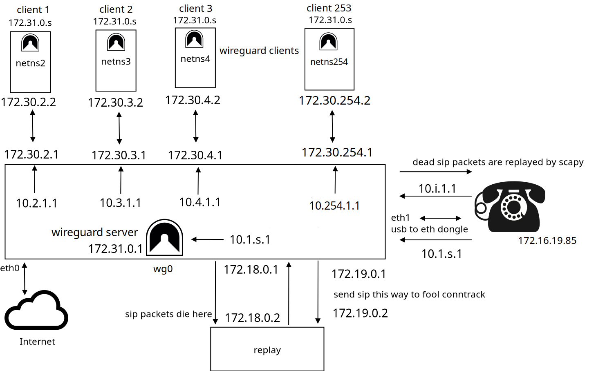

# Voider



---

**Direct IP Calls.**  
Calls are IP agnostic. SRTP is natively supported by the phones.  
**Private phone number:** `172.16.19.85/30`  
**Gateway:** `172.16.19.86/30`

*Agnostic* in the sense that on the good old phones you did not know who was calling you, because old phones don't have a display.  
You will see the call incoming from a specific fake IP address, but you may or may not map that to the caller’s real IP address.  
So perhaps "anonymous phone calls" is a better term. There is even a **Do Not Disturb** feature: the phone stays quiet and the caller gets a busy signal.

---

### Disclaimer

- You need to already be using a Linux machine for this setup.
- You must know how to SSH into a Linux machine.
- After setup, this Raspberry Pi (or similar device) will be dedicated solely to acting like the good old phones as shown in the picture.
- This software assumes that source ports are not filtered/changed outwards, which is typically the case with most retail routers.

---

### How to Install

1. **Flash Alpine Linux:**

   ```bash
   dd if=alpine-rpi-3.20.3-aarch64.img of=/dev/sdX bs=4M
   ```

2. **Run setup-alpine:**

   - Set up another user besides root (DHCP on eth0 is fine).
   - Choose UTC as the timezone and install chrony. This is crucial so that all devices are synchronized.

   *Note: Use the same micro SD card for the OS (device type mmcblk0).*

3. **SSH Preparedness:**

   - Make sure to have an SSH certificate to log in to your Raspberry Pi **before continuing**.
   - Log in a couple of times using that certificate to avoid getting locked out after the setup.

4. **Clone the Repository:**

   ```bash
   git clone https://github.com/slave-blocker/voider.git
   cd voider/voider
   ```

5. **Installation Steps:**

   - **As a normal user:**

     ```bash
     doas ./install.sh
     ```

   - **As root:**

     *(Choose WireGuard, set quad9, disable IPv6 and at the end, don't reboot—the script will do that for you.)*

     ```bash
     ./install_as_root.sh
     ```

---

### How to Setup

1. Change to the configuration directory:

   ```bash
   cd ~/.config/voider
   ```

2. **Choose interfaces:**  
   This sets up `/etc/network/interfaces` and then reboots. (Make sure the phone is already connected to the Raspberry Pi.)

3. After reboot, return to the config directory:

   ```bash
   cd ~/.config/voider
   ```

4. **Initialize Main Script:**  

   ```bash
   doas ./main.sh
   ```

   This sets up the SFTP connections over Tor. Once `doas ./main.sh` returns the available options, you're all set.

---

### How to Use

1. **Phone Hardware:**  
   Buy a Grandstream IP phone that supports Direct IP Calling (tested with GXP1610).

2. **System Setup:**  
   Install Voider on a Raspberry Pi or any Linux machine and connect the Grandstream phone to the USB dongle of your device.

3. **Run the Main Script:**

   ```bash
   doas ./main.sh
   ```

   This creates new clients or connects to servers.

4. **Direct IP Call Usage:**

   - **Clients:**  
     • 1st client: `10.1.2.1`  
     • 2nd client: `10.1.3.1`  
     • 3rd client: `10.1.4.1`  
     … etc.

   - **Servers:**  
     • 1st server: `10.2.1.1`  
     • 2nd server: `10.3.1.1`  
     • 3rd server: `10.4.1.1`  
     … etc.

   **_Note:_** Out of the box, Grandstream phones use RTP. To enable SRTP, access your phone's web interface and navigate to:  
   **Account → Audio Settings → SRTP** (set to "Enabled and Forced").

---

### Under The Hood

There's **no PBX** involved. Instead:
- SIP packets die before reaching the callee.
- Deep packet inspection occurs where the real IP (`172.16.19.85`) is replaced by a fake address.
- The packet is then replayed towards the callee phone via Scapy and tcprewrite.

---

### Security Note

- A server passes its certificate for SFTP over Tor so that its clients can connect using torsocks.
- A client possessing the certificate can only log in via SFTP to the Raspberry Pi.
- The user, named "self", has a restricted shell `/bin/false`.
- Once logged into the SFTP chroot directory `/var/sftp/self/`, the user can only write to files listed by `ls` (up to 2KB per file).
- Only 8 processes are available for "self" on the server (2 processes per SFTP connection), limiting simultaneous SFTP connections to 4.
- This is acceptable since Torified SFTP sessions are only for read/write operations lasting a few seconds.

*Future enhancement:* Making Voider mobile—just plug it in at a different house behind a new router with zero configuration on your part—is coming soon™.

---

### Feedback

Please contact me for:
- Criticisms
- Suggestions
- Questions
- Kudos  
Even mobbing attempts are welcome!

Remember: If your hardware is backdoored, then you're backdoored anyway.

IRC: **monero-pt**

Special thanks to Andreas Hein!

---

### A Do Nation is the Best Nation!

---

### MONERO


